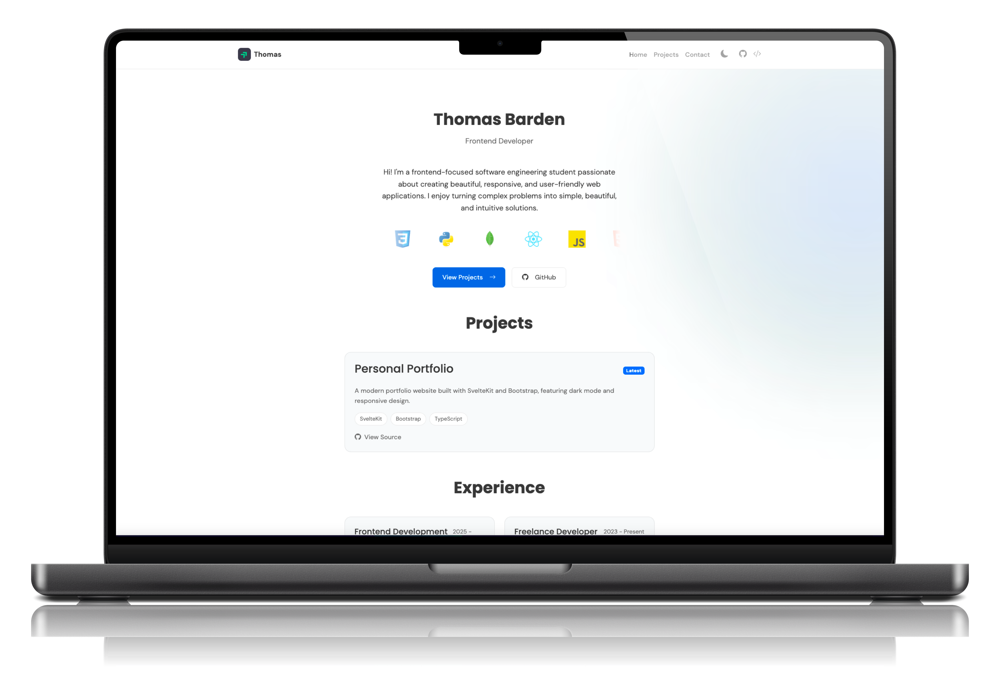

<div align="center">

# Personal Portfolio



[](https://thomasbarden.com)
[](https://sentry.io)
[](https://kit.svelte.dev)
[](https://www.typescriptlang.org)

A modern, responsive portfolio website with error monitoring and automated deployments.

[Live Demo](https://thomasbarden.com) · [Report Bug](https://github.com/ctrlthomas/personal-portfolio/issues) · [Request Feature](https://github.com/ctrlthomas/personal-portfolio/issues)

</div>

---

## ✨ Features

<table>
<tr>
<td>

- 🎨 Modern UI with smooth animations
- 🌓 Dark/Light mode with persistence
- 📱 Fully responsive design
- ⚡ Fast performance with SvelteKit
- ♿ Accessibility features

</td>
<td>

- 🔧 Easy to customize
- 📬 Contact form with validation
- 🎯 SEO optimized
- 📊 Error monitoring with Sentry
- 🚀 Automated deployments

</td>
</tr>
</table>

## 🛠️ Tech Stack

<table>
<tr>
<td>

### Frontend
- [SvelteKit](https://kit.svelte.dev)
- [Bootstrap 5](https://getbootstrap.com)
- [TypeScript](https://www.typescriptlang.org)

</td>
<td>

### DevOps
- [Sentry](https://sentry.io)
- [GitHub Actions](https://github.com/features/actions)
- [Vercel](https://vercel.com)

</td>
</tr>
</table>

## 🚀 Getting Started

### Prerequisites

- Node.js (version 16 or higher)
- npm or pnpm
- Getform.io account for contact form
- Sentry account for error monitoring
- Vercel account for deployment

### Installation

1. Clone the repository:
```bash
git clone https://github.com/ctrlthomas/personal-portfolio.git
```

2. Install dependencies:
```bash
cd personal-portfolio
npm install
```

3. Start the development server:
```bash
npm run dev
```

4. Open your browser and navigate to `http://localhost:5173`

### Environment Variables

Rename `.env.example` to `.env` file with the following and fill out the required information.

## Building for Production

To create a production build:

```bash
npm run build
```

Preview the production build:
```bash
npm run preview
```

## Customization

1. Modify `src/routes/+page.svelte` to update the main content
2. Update `src/app.css` to change the theme and styling
3. Edit `src/app.html` to update meta tags and global scripts

## License

This project is open source and available under the MIT License.

## Contact

Thomas Barden - [thomas@thomasbarden.com](mailto:thomas@thomasbarden.com)

Project Link: [https://github.com/ctrlthomas/personal-portfolio](https://github.com/ctrlthomas/personal-portfolio)
